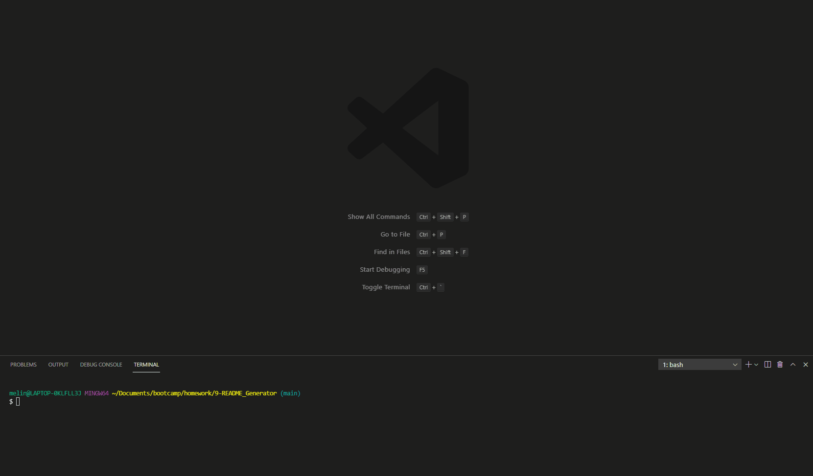

# README file Generator
 
## Description: 
This is a command line app using node.js and inquirer.js for users to generate a quality README file for their applications by answering the questions presented in the command line.  This tool will allow users to easily generate their README files in one easy step without forgetting to include pertinent inforamation. 
## Table of Contents: 
* [Installation](#installation)
* [Usage](#usage) 
* [License](#license) 
* [Contributing](#contributing) 
* [Tests](#tests) 
* [Questions](#questions) 
## Installation: 
Run npm install to install dependencies.
## Usage: 
Run node index.js in the command line to start the readme generator, then answer the prompts. 

## License: 
Licensed under the MIT license.
## Contributing:
Feel free to contact me to contribute to this project. My contact information is listed below. 
## Tests: 
There are no tests for this applicaion at this time.
## Questions
GitHub: [melinamboedecker](https://github.com/melinamboedecker) 

If you have any additional questions, please contact me at melinamboedecker@gmail.com
